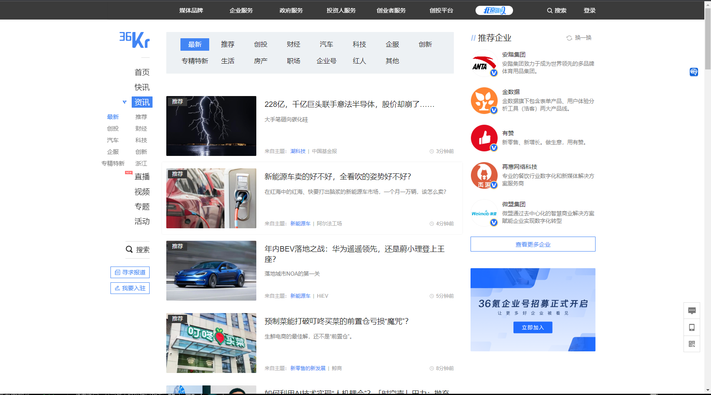
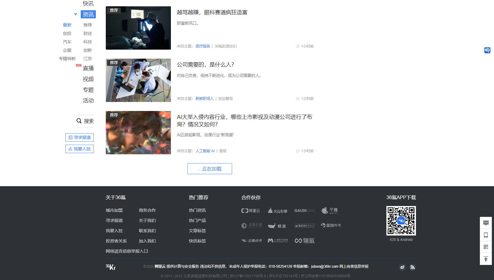
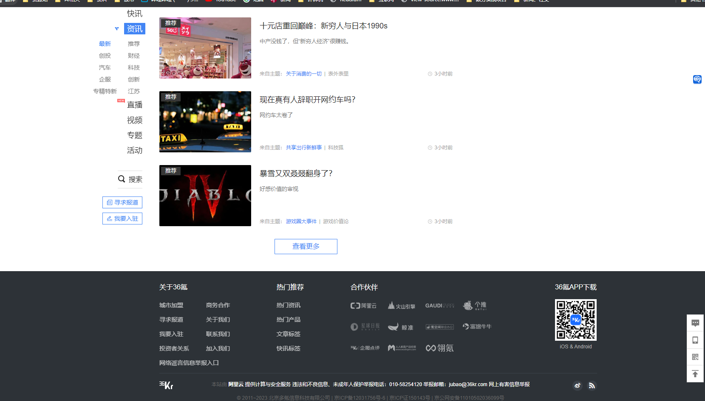
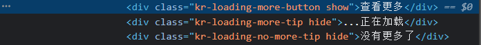
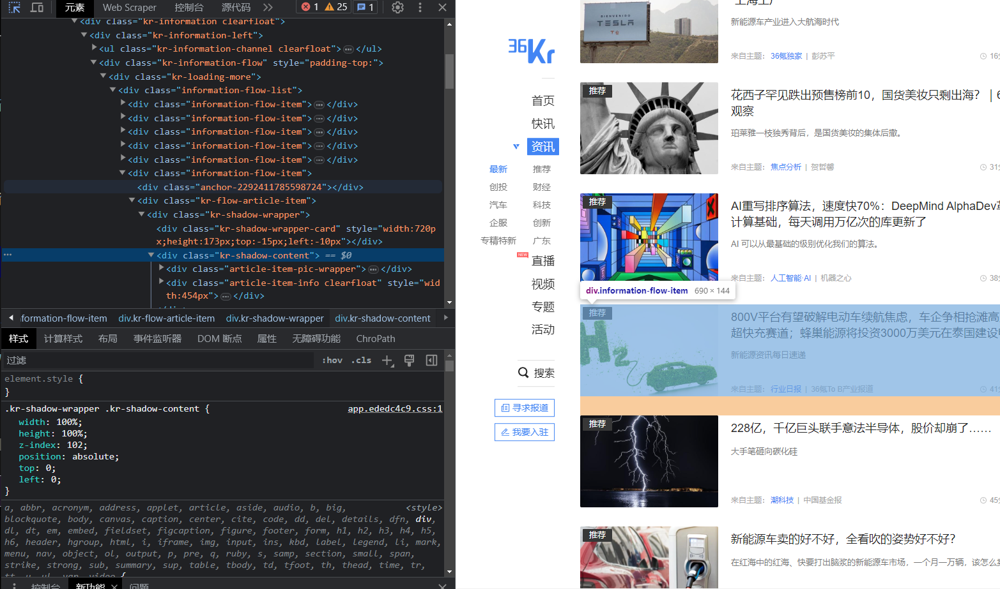
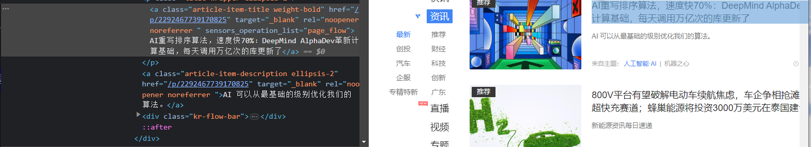
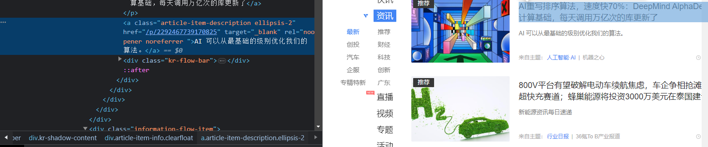
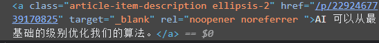

36氪是一家财经与科技新媒体。主要内容包括创业资讯、公司报道、投融资信息、行业分析、人物专访等。其报道涵盖了互联网、人工智能、物联网、区块链、生物技术等多个领域。

如果每天都要打开网页，再一条条翻看新闻是一件十分繁琐的事，如果能一次性把新闻信息存到excel里，等需要时再细看某条新闻就好了。

我们准备写一个爬虫来搜索网站主页提供的新闻信息，内容包括标题、详情链接、新闻概述。

我会使用selenium模拟用户行为来完成爬虫，用BeautifulSoup对页面进行解析。除此以外，用ChromeDriverManager自动匹配和下载需要的chrome浏览器。
导入time模块设置必要的延迟，xlwt存储数据。
```
import time
import xlwt
from bs4 import BeautifulSoup
from selenium import webdriver
from webdriver_manager.chrome import ChromeDriverManager
```

我们从资讯页面开始，这里可以看到许多新闻。
https://36kr.com/information/web_news/

```   
driver = webdriver.Chrome(ChromeDriverManager().install())
url = 'https://www.36kr.com/information/web_news/latest'
driver.get(url)
```
我们先研究一下怎样实现翻页功能，
下拉页面，我们会发现36氪的翻页可分为两个部分，
第一次下拉，会自动加载第二页内容，
第二次下拉，会自动加载第三页内容，
但继续翻页就需要点击查看更多按钮。



所以，我们需要用两种方式来实现翻页。
对于自动加载，我们只需要让浏览器下拉到底部即可，selenium模块可以轻松的完成这项工作：
```
time.sleep(2)  # 等待页面加载
driver.execute_script("window.scrollTo(0, document.body.scrollHeight);") #滚动到底
time.sleep(2)  # 等待页面加载
driver.execute_script("window.scrollTo(0, document.body.scrollHeight);")  # 滚动到底
```
然后，我们还要点击“查看更多”来实现后续的翻页，通过：
```driver.find_element_by_class_name('kr-loading-more-button')```

可以定位到“查看更多”标签。不过，需要注意的是，
我们仍然需要先把页面拉到最底层，否则是定位不到标签的。
同时，我们可以写一个while循环来重复点击“查看更多”标签，以爬取后续页面，
再用一个if循环检查是否已经到达最后一页。
```
def pages(driver,page_num):  #page_num是爬取的页面
    i = 1
    while True:
        driver.execute_script("window.scrollTo(0, document.body.scrollHeight);")  # 滚动到底
        time.sleep(2)  # 等待页面加载
        if i == page_num: # 判断页面数
            break
        else:
            if_continue = driver.find_element_by_class_name('kr-loading-more-button')
            if if_continue.text == '查看更多': #是否还有页面
                driver.execute_script("window.scrollTo(0, document.body.scrollHeight);")  # 滚动到底
                next_page = driver.find_element_by_class_name('kr-loading-more-button') #“查看更多”标签
                next_page.click() #点击
            else:
                print("没有更多了") #没新页面可爬
        i += 1
```
实现翻页以后，我们还需要获取需要信息并进行下载。
我们观察页面会发现需要的新闻信息存在<div kr-shadow-content>标签下，
先用BeautifulSoup处理页面，然后用find_all方法找到所有的<div kr-shadow-content>标签，并形成一个列表。

```
 soup = BeautifulSoup(driver.page_source, 'html.parser')
 articles = soup.find_all('div', class_='kr-shadow-content')
```
遍历列表，用find方法一个个找出我们需要的信息。
get_text()方法能够用来提取标签中的文字，因此先用find找到标题、简介的标签，
再用get_text()提取文字即可。


不过，要取得新闻的链接会曲折一点，标签中没有提供新闻详情的链接。
我们打开一则新闻进行观察，发现新闻详情页的网址就是36氪的网址，
拼上标签栏中提供的一串数字，利用article.find("a")['href']找到数字，
再接上36氪的链接https://36kr.com/。


```
for article in articles:
    title = article.find("a",class_="article-item-title").get_text()
    link = "https://www.36kr.com" + article.find("a")['href']
    summary = article.find("a",class_="article-item-description ellipsis-2").get_text()
```
现在，我们已经可爬到我们想要的信息。
下一步我们要把信息储存起来，我们把储存的过程和数据的获取写进同一个函数。
```
def save_page(driver):
    n = 1 #行数
    wb = xlwt.Workbook(encoding="utf-8", style_compression=0) #创建工作簿
    sheet = wb.add_sheet("新闻", cell_overwrite_ok=True) #创建一个新闻表
    #写入表头
    sheet.write(0, 0, "序号")
    sheet.write(0, 1, "名称")
    sheet.write(0, 2, "链接")
    sheet.write(0, 3, "观看次数")
    #爬取数据
    soup = BeautifulSoup(driver.page_source, 'html.parser')
    articles = soup.find_all('div', class_='kr-shadow-content')
    for article in articles:
        title = article.find("a",class_="article-item-title").get_text()
        link = "https://www.36kr.com" + article.find("a")['href']
        summary = article.find("a",class_="article-item-description ellipsis-2").get_text()
        #写入数据
        sheet.write(n, 0, n)
        sheet.write(n, 1, title)
        sheet.write(n, 2, link)
        sheet.write(n, 3, summary)
        n = n + 1 #保存
    wb.save("36k_news.xls")
```
最后放上完整代码：
```
import time
import xlwt
from bs4 import BeautifulSoup
from selenium import webdriver
from webdriver_manager.chrome import ChromeDriverManager

page_num = 3

def get_article_info(url):
    driver.get(url)

    time.sleep(2)  # 等待页面加载
    driver.execute_script("window.scrollTo(0, document.body.scrollHeight);") #滚动到底
    time.sleep(2)  # 等待页面加载
    driver.execute_script("window.scrollTo(0, document.body.scrollHeight);")  # 滚动到底
    time.sleep(2)  # 等待页面加载

    pages(driver,page_num)
    save_page(driver) #储存数据

def save_page(driver):
    n = 1
    wb = xlwt.Workbook(encoding="utf-8", style_compression=0)
    sheet = wb.add_sheet("新闻", cell_overwrite_ok=True)
    sheet.write(0, 0, "序号")
    sheet.write(0, 1, "名称")
    sheet.write(0, 2, "链接")
    sheet.write(0, 3, "观看次数")

    soup = BeautifulSoup(driver.page_source, 'html.parser')
    articles = soup.find_all('div', class_='kr-shadow-content')
    for article in articles:
        title = article.find("a",class_="article-item-title").get_text()
        link = "https://www.36kr.com" + article.find("a")['href']
        summary = article.find("a",class_="article-item-description ellipsis-2").get_text()

        sheet.write(n, 0, n)
        sheet.write(n, 1, title)
        sheet.write(n, 2, link)
        sheet.write(n, 3, summary)
        n = n + 1
    wb.save("36k_news.xls")

def pages(driver,page_num):
    i = 1
    while True:
        driver.execute_script("window.scrollTo(0, document.body.scrollHeight);")  # 滚动到底
        time.sleep(2)  # 等待页面加载
        if i == page_num:
            break
        else:
            if_continue = driver.find_element_by_class_name('kr-loading-more-button')
            if if_continue.text == '查看更多':
                driver.execute_script("window.scrollTo(0, document.body.scrollHeight);")  # 滚动到底
                next_page = driver.find_element_by_class_name('kr-loading-more-button')
                next_page.click()
            else:
                print("没有更多了")
        i += 1

if __name__ == "__main__":
    driver = webdriver.Chrome(ChromeDriverManager().install())
    url = 'https://www.36kr.com/information/web_news/latest'
    get_article_info(url)
```